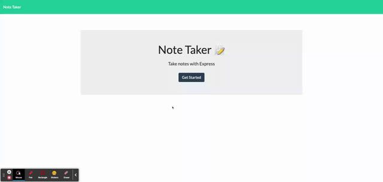

# Note Taker

## Description
--------------
Note Taker is a web application application that enables a user to add, save and delete notes. This application uses an Express.js back end and saves and retrieves note data from a JSON file. The application is deployed to Heroku.

The following GIF displays the app's functionality:



## Table of Contents

- [Description](#description)
- [User Story](#user-story)
- [Acceptance Criteria](#acceptance-criteria)
- [Installation](#installation)
- [License](#license)
- [Usage](#usage)
- [Contributing](#contributing)
- [Review & Deploy](#review-and-deploy)
- [Questions](#questions)


## User Story

```
AS A small business owner
I WANT to be able to write and save notes
SO THAT I can organize my thoughts and keep track of tasks I need to complete
```


## Acceptance Criteria

```
GIVEN a note-taking application
WHEN I open the Note Taker
THEN I am presented with a landing page with a link to a notes page
WHEN I click on the link to the notes page
THEN I am presented with a page with existing notes listed in the left-hand column, plus empty fields to enter a new note title and the note’s text in the right-hand column
WHEN I enter a new note title and the note’s text
THEN a Save icon appears in the navigation at the top of the page
WHEN I click on the Save icon
THEN the new note I have entered is saved and appears in the left-hand column with the other existing notes
WHEN I click on an existing note in the list in the left-hand column
THEN that note appears in the right-hand column
WHEN I click on the Write icon in the navigation at the top of the page
THEN I am presented with empty fields to enter a new note title and the note’s text in the right-hand column
```

## Installation
---
```bash
npm i
```

## License
---
This application is licensed under:

- [MIT License](https://choosealicense.com/licenses/mit/)


## Usage
---
Run the following command at th root of your project and answer the prompted questions:

```bash
npm start
```

## Contributing
---
Pull requests are welcome. For major changes, please open an issue first to discuss what you would like to change.

Please make sure to update tests as appropriate.

## Review and Deploy
---
To review the refactored code, please go to the [repository](https://github.com/sistaniabong/note-taker)

To deploy this web application, please click on this [link](https://sheltered-river-05532.herokuapp.com/)


## Questions
---
If you have any questions, please feel free to check out my github account and email me at the email address below:

Github account: [sistaniabong](https://github.com/sistaniabong)

Email address: sistaniawibonele@gmail.com